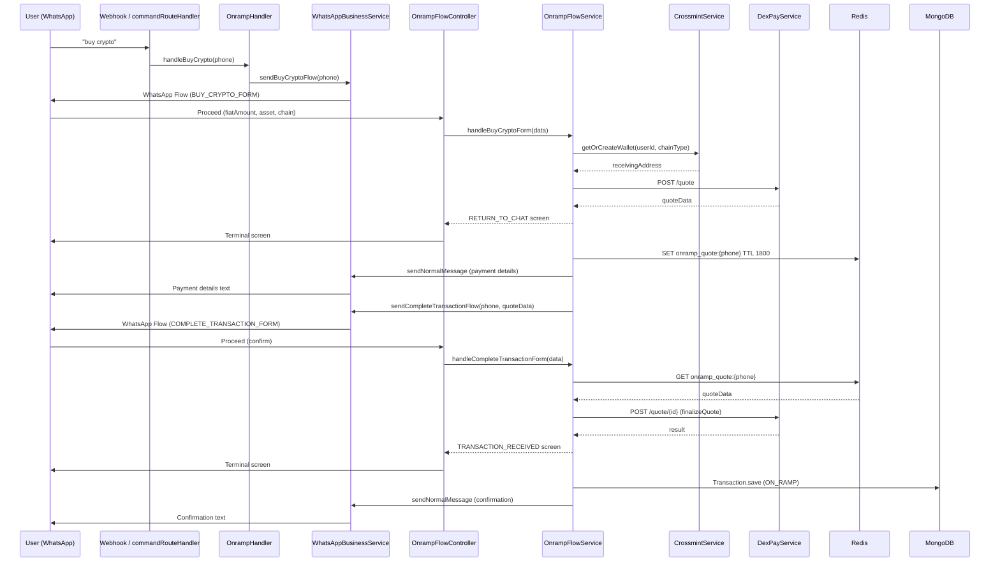

# Design Document: Crypto Onramp

## Overview

The crypto onramp feature integrates into the existing ChainPaye WhatsApp bot to let users buy USDC or USDT with NGN via DexPay. The flow is split across two WhatsApp Flows: one to collect purchase details and submit a quote, and a second to confirm and execute the quote. All new code follows the existing patterns in the codebase (flowMiddleware, sendTextOnlyFlowWithDataById, Redis for session state, etc.).

---

## Architecture



---

## Components and Interfaces

### New Files

**`commands/handlers/onrampHandler.ts`**
- Exports `handleBuyCrypto(phoneNumber: string): Promise<void>`
- Looks up user by phone, calls `whatsappBusinessService.sendBuyCryptoFlow(phone)`
- Sends error message if user not found

**`webhooks/controllers/onrampFlow.controller.ts`**
- Exports `onrampFlowController` — the Express route handler wrapped with `flowMiddleware`
- Delegates all screen logic to `OnrampFlowService`
- Handles `ping`, `INIT`, `data_exchange` actions

**`webhooks/services/onrampFlowService.ts`**
- Exports `getOnrampFlowScreen(decryptedBody)` — the core state machine
- Handles screens: `BUY_CRYPTO_FORM`, `COMPLETE_TRANSACTION_FORM`
- Calls CrossmintService, DexPayService, Redis, WhatsAppBusinessService, Transaction model

**`webhooks/buy_crypto_flow.json`**
- WhatsApp Flow JSON definition for the BUY_CRYPTO_FORM → RETURN_TO_CHAT screens

**`webhooks/complete_transaction_flow.json`**
- WhatsApp Flow JSON definition for the COMPLETE_TRANSACTION_FORM → TRANSACTION_RECEIVED screens

### Modified Files

**`commands/config.ts`** — add `buyCrypto` command entry with triggers `["buy crypto", "buy usdc", "buy usdt", "/buycrypto"]`

**`commands/route.ts`** — add `case "buyCrypto": await handleBuyCrypto(from); break;`

**`webhooks/route/route.ts`** — add `router.post("/buy-crypto", onrampFlowController)` and `router.post("/complete-transaction", onrampFlowController)`

**`services/WhatsAppBusinessService.ts`** — add `sendBuyCryptoFlow(to: string)` and `sendCompleteTransactionFlow(to: string, quoteData: OnrampQuoteData)`

**`models/Transaction.ts`** — add `ON_RAMP = "on_ramp"` to `TransactionType` enum

**`config/whatsapp.ts`** — add `ONRAMP` and `COMPLETE_TRANSACTION` flow ID entries in both PRODUCTION and STAGING objects

---

## Data Models

### OnrampQuoteData (in-memory / Redis shape)

```typescript
interface OnrampQuoteData {
  id: string;              // DexPay quote ID
  fiatAmount: number;      // NGN amount user entered
  tokenAmount: number;     // Crypto amount to receive
  price: number;           // Exchange rate (NGN per token)
  fee: number;             // DexPay fee
  paymentAccount: {
    accountName: string;
    accountNumber: string;
    bankName: string;
  };
  receivingAddress: string; // User's wallet address
  asset: string;            // "USDC" | "USDT"
  chain: string;            // "BSC" | "SOL" | "BASE" | "ARBITRUM"
}
```

Redis key: `onramp_quote:{phoneNumber}` (e.g. `onramp_quote:+2348012345678`)
TTL: 1800 seconds

### Transaction (additions to existing model)

Add to `TransactionType` enum:
```typescript
ON_RAMP = "on_ramp"
```

When saving an onramp transaction:
```typescript
{
  type: TransactionType.ON_RAMP,
  fromUser: user._id,
  amount: quoteData.fiatAmount,
  currency: "NGN",
  status: TransactionStatus.PENDING,
  description: `Buy ${quoteData.tokenAmount} ${quoteData.asset} on ${quoteData.chain}`,
  toronetTransactionId: result.orderId || `ONRAMP_${quoteData.id}`,
  totalAmount: quoteData.fiatAmount,
}
```

### WhatsApp Config additions

```typescript
// In both PRODUCTION_FLOW_IDS and STAGING_FLOW_IDS:
ONRAMP: process.env.WHATSAPP_ONRAMP_FLOW_ID || "",
COMPLETE_TRANSACTION: process.env.WHATSAPP_COMPLETE_TRANSACTION_FLOW_ID || "",
```

---

## Flow Screen Logic

### OnrampFlowService state machine

```
action === "ping"
  → return { data: { status: "active" } }

action === "INIT"
  → return { screen: "BUY_CRYPTO_FORM", data: {} }

action === "data_exchange"
  screen === "BUY_CRYPTO_FORM"
    1. Resolve phone from Redis via flow_token
    2. Look up user by phone
    3. Determine chainType: BSC/BASE/ARBITRUM → "evm", SOL → "solana"
    4. getOrCreateWallet(userId, chainType) → receivingAddress
    5. Call DexPay POST /quote
    6. On success:
       a. Store quote in Redis (onramp_quote:{phone}, TTL 1800)
       b. Send payment details text message (async, don't block)
       c. Send COMPLETE_TRANSACTION flow (async, don't block)
       d. Return { screen: "RETURN_TO_CHAT", data: {} }
    7. On error:
       a. Send error text message (async)
       b. Return { screen: "BUY_CRYPTO_FORM", data: { error_message: "..." } }

  screen === "COMPLETE_TRANSACTION_FORM"
    1. Resolve phone from Redis via flow_token
    2. GET onramp_quote:{phone} from Redis
    3. If null → return error on screen
    4. Call dexPayService.finalizeQuote(quoteData.id)
    5. On success:
       a. Save Transaction to DB (async, don't block flow response)
       b. Send confirmation text (async)
       c. Return { screen: "TRANSACTION_RECEIVED", data: {} }
    6. On expired (410) → return error on screen
    7. On other error → return error on screen
```

### Chain → chainType mapping

| Chain     | chainType |
|-----------|-----------|
| BSC       | evm       |
| BASE      | evm       |
| ARBITRUM  | evm       |
| SOL       | solana    |

---

## Correctness Properties

*A property is a characteristic or behavior that should hold true across all valid executions of a system — essentially, a formal statement about what the system should do. Properties serve as the bridge between human-readable specifications and machine-verifiable correctness guarantees.*

Property 1: Chain-to-chainType mapping is exhaustive and correct
*For any* chain value in {BSC, BASE, ARBITRUM, SOL}, the mapping function SHALL return exactly "evm" for EVM chains and "solana" for SOL, with no chain returning an undefined or incorrect chainType.
**Validates: Requirements 3.1, 3.2**

Property 2: Quote Redis round-trip
*For any* valid OnrampQuoteData object, serializing it to JSON and storing it in Redis then retrieving and deserializing it SHALL produce an object deeply equal to the original.
**Validates: Requirements 5.1, 5.3**

Property 3: Quote TTL is always 1800 seconds
*For any* quote stored via the onramp service, the Redis TTL set SHALL equal exactly 1800 seconds.
**Validates: Requirements 5.2**

Property 4: Payment details message contains all required fields
*For any* OnrampQuoteData, the formatted payment details message string SHALL contain fiatAmount, tokenAmount, price, bankName, accountName, and accountNumber.
**Validates: Requirements 6.1**

Property 5: Error response always contains error_message
*For any* error-triggering input to the flow service (wallet failure, DexPay failure, Redis miss, expired quote), the returned screen data object SHALL contain a non-empty `error_message` string.
**Validates: Requirements 10.1, 10.2, 10.3, 7.5**

Property 6: Transaction invariants on successful finalize
*For any* successful finalizeQuote result, the Transaction document created SHALL have `type = ON_RAMP`, `currency = "NGN"`, `status = PENDING`, and `amount` equal to the fiatAmount from the quote.
**Validates: Requirements 8.1, 8.2, 8.3**

Property 7: Quote request always includes type "BUY"
*For any* combination of valid fiatAmount, asset, chain, and receivingAddress inputs, the DexPay quote request payload constructed by the onramp service SHALL always include `type: "BUY"`.
**Validates: Requirements 2.4, 4.1**

Property 8: Confirmation message contains required fields
*For any* OnrampQuoteData, the formatted confirmation message string SHALL contain the fiatAmount, tokenAmount, and asset name.
**Validates: Requirements 9.2**

---

## Error Handling

| Scenario | Handling |
|---|---|
| User not found on command trigger | Send text: "Account not found. Type *menu* to get started." |
| Wallet creation/retrieval fails | Return `error_message` on BUY_CRYPTO_FORM screen; send async text |
| DexPay /quote fails | Return `error_message` on BUY_CRYPTO_FORM screen; send async text |
| Redis quote missing on COMPLETE_TRANSACTION_FORM | Return `error_message`: "Session expired. Please type *buy crypto* to start again." |
| DexPay finalizeQuote returns 410 (expired) | Return `error_message`: "Quote expired. Please type *buy crypto* to get a new quote." |
| DB save fails | Log error; still send confirmation message to user |
| Unhandled flow action | Log error; throw (flowMiddleware handles graceful response) |

---

## Testing Strategy

### Unit Tests

- `onrampFlowService`: test each screen branch (BUY_CRYPTO_FORM success, BUY_CRYPTO_FORM wallet error, BUY_CRYPTO_FORM DexPay error, COMPLETE_TRANSACTION_FORM success, COMPLETE_TRANSACTION_FORM Redis miss, COMPLETE_TRANSACTION_FORM expired quote)
- `onrampHandler`: test user-not-found path and happy path
- Chain-to-chainType mapping function: test all four chain values

### Property-Based Tests

Use `fast-check` for TypeScript property-based testing.

Each property test MUST run a minimum of 100 iterations.

- **Property 1** — Chain mapping exhaustiveness: generate arbitrary chain strings from {BSC, BASE, ARBITRUM, SOL}, assert correct chainType returned.
  Tag: `Feature: crypto-onramp, Property 1: chain-to-chainType mapping is exhaustive and correct`

- **Property 2** — Quote Redis round-trip: generate arbitrary OnrampQuoteData objects, serialize → store → retrieve → deserialize, assert deep equality.
  Tag: `Feature: crypto-onramp, Property 2: quote Redis round-trip`

- **Property 3** — Quote TTL: for any quote stored, assert TTL equals exactly 1800.
  Tag: `Feature: crypto-onramp, Property 3: quote TTL is always 1800 seconds`

- **Property 4** — Payment message completeness: generate arbitrary OnrampQuoteData, call the message formatter, assert all required fields appear in the output string.
  Tag: `Feature: crypto-onramp, Property 4: payment details message contains all required fields`

- **Property 5** — Error response shape: for any error-triggering input, assert the returned object has a non-empty `error_message`.
  Tag: `Feature: crypto-onramp, Property 5: error response always contains error_message`

- **Property 6** — Transaction invariants: for any successful finalize, assert type=ON_RAMP, currency=NGN, status=PENDING, amount=fiatAmount.
  Tag: `Feature: crypto-onramp, Property 6: transaction invariants on successful finalize`

- **Property 7** — Quote request type field: for any valid form inputs, assert the DexPay payload always has type="BUY".
  Tag: `Feature: crypto-onramp, Property 7: quote request always includes type BUY`

- **Property 8** — Confirmation message completeness: generate arbitrary OnrampQuoteData, call the confirmation message formatter, assert fiatAmount, tokenAmount, and asset appear in the output.
  Tag: `Feature: crypto-onramp, Property 8: confirmation message contains required fields`
