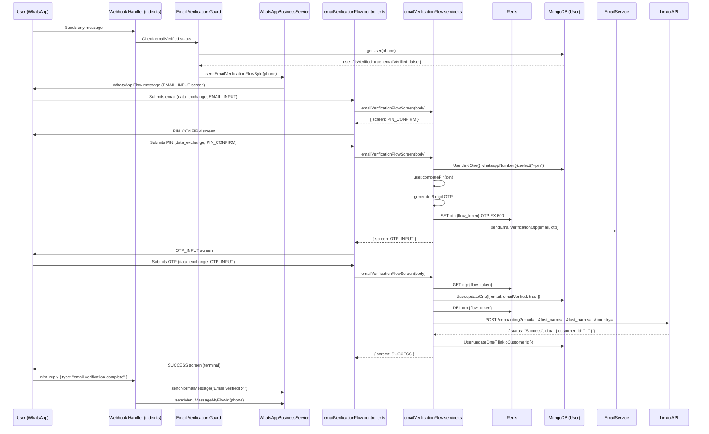

# Design Document: Email Verification Flow

## Overview

After a user completes KYC, they must verify an email address before they can use any bot features. This design adds a WhatsApp Flow that walks the user through four screens — email input, PIN confirmation, OTP entry, and success — and then calls the Linkio onboarding API to register the user as a customer. A guard in the existing webhook message handler intercepts every inbound message from a KYC-verified, email-unverified user and redirects them into this flow.

The implementation follows the established patterns in the codebase:
- Flow JSON in `webhooks/`
- Flow service in `webhooks/services/`
- Flow controller in `webhooks/controllers/`
- Route registered in `webhooks/route/route.ts`
- Flow ID in `config/whatsapp.ts`
- Flow trigger method in `services/WhatsAppBusinessService.ts`
- Guard logic in `webhooks/index.ts`

---

## Architecture



---

## Components and Interfaces

### 1. User Model Extensions (`models/User.ts`)

Two new fields are added to `IUser` and `UserSchema`:

```typescript
emailVerified: boolean;       // default: false
linkioCustomerId?: string;    // stored after successful Linkio onboarding
```

### 2. Flow JSON (`webhooks/email_verification_flow.json`)

Defines four screens following the `version: "7.2"` / `data_api_version: "3.0"` format used by all existing flows.

Routing model:
```
EMAIL_INPUT → PIN_CONFIRM → OTP_INPUT → SUCCESS
```

Each screen carries an `error_message` string field (empty by default) and a `has_error` boolean so the service can surface validation errors without navigating away.

### 3. Flow Service (`webhooks/services/emailVerificationFlow.service.ts`)

Exports a single function:

```typescript
export async function emailVerificationFlowScreen(decryptedBody: {
  screen: string;
  data: any;
  version: string;
  action: string;
  flow_token: string;
}): Promise<object>
```

Handles `ping`, `error`, `INIT`, and `data_exchange` actions. Screen-level logic:

| Screen | Input | Success transition | Failure |
|---|---|---|---|
| `EMAIL_INPUT` | `email` | → `PIN_CONFIRM` | Re-render `EMAIL_INPUT` with error |
| `PIN_CONFIRM` | `pin`, `email` (carried) | → `OTP_INPUT` (after OTP sent) | Re-render `PIN_CONFIRM` with error |
| `OTP_INPUT` | `otp`, `email` (carried) | → `SUCCESS` (after DB + Linkio update) | Re-render `OTP_INPUT` with error |

### 4. Flow Controller (`webhooks/controllers/emailVerificationFlow.controller.ts`)

Thin wrapper using the existing `flowMiddleware`:

```typescript
export const emailVerificationFlowController = flowMiddleware(
  async (req, res) => {
    const { decryptedBody } = req.decryptedData!;
    return emailVerificationFlowScreen(decryptedBody);
  }
);
```

### 5. Route Registration (`webhooks/route/route.ts`)

```typescript
router.post("/email-verification", emailVerificationFlowController);
```

### 6. WhatsApp Config (`config/whatsapp.ts`)

New key added to both `PRODUCTION_FLOW_IDS` and `STAGING_FLOW_IDS`:

```typescript
EMAIL_VERIFICATION: process.env.WHATSAPP_EMAIL_VERIFICATION_FLOW_ID || "",
```

### 7. WhatsApp Business Service (`services/WhatsAppBusinessService.ts`)

New public method:

```typescript
async sendEmailVerificationFlowById(to: string): Promise<void>
```

Uses the existing `sendTextOnlyFlowById` private helper with the `EMAIL_INPUT` screen as the initial screen.

### 8. Email Service Extension (`services/EmailService.ts`)

New exported function:

```typescript
export async function sendEmailVerificationOtp(
  toEmail: string,
  otp: string,
): Promise<void>
```

Sends a branded HTML email containing the 6-digit OTP and a 10-minute expiry notice.

### 9. Email Verification Guard (`webhooks/index.ts`)

Inside the existing `app.post("/webhook", ...)` handler, after the user is confirmed as registered, a guard block is inserted before `commandRouteHandler` is called:

```typescript
// Guard: email verification gate
if (user.isVerified && !user.emailVerified) {
  await whatsappBusinessService.sendEmailVerificationFlowById(phone);
  return res.sendStatus(200);
}
```

The `nfm_reply` handler is extended to handle `type === "email-verification-complete"`.

---

## Data Models

### Updated `IUser` interface

```typescript
export interface IUser extends Document {
  // ... existing fields ...
  emailVerified: boolean;
  linkioCustomerId?: string;
}
```

### Updated `UserSchema`

```typescript
emailVerified: {
  type: Boolean,
  default: false,
},
linkioCustomerId: {
  type: String,
  trim: true,
  sparse: true,
},
```

### Redis Keys

| Key pattern | Value | TTL |
|---|---|---|
| `{flow_token}` | phone number (existing pattern) | 24 hours |
| `otp:{flow_token}` | 6-digit OTP string | 600 seconds (10 min) |

### Linkio API Request

```
POST https://api.linkio.world/transactions/v2/direct_ramp/onboarding
  ?email={user.email}
  &last_name={user.lastName}
  &first_name={user.firstName}
  &country={user.country}

Headers:
  ngnc-sec-key: ngnc_s_lk_0cd3b9819b72a06fb4d5f28ded9accc4b434262b8d30620e12e8f932249bf3a2
```

### Linkio API Success Response

```json
{
  "status": "Success",
  "message": "Customer created",
  "data": {
    "customer_id": "VHlwZXM6OkNhc2hyYW1wOjpBUEk6Ok1lcmNoYW50Q3VzdG9tZXItYjAyZjA4NWQtZjFlNi00MzVlLWI1YzctNWVlMmFhNzg3YTM3",
    "email": "user@example.com",
    "firstName": "John",
    "lastName": "Doe"
  }
}
```

---

## Correctness Properties

*A property is a characteristic or behavior that should hold true across all valid executions of a system — essentially, a formal statement about what the system should do. Properties serve as the bridge between human-readable specifications and machine-verifiable correctness guarantees.*

### Property 1: Email verification gate is total

*For any* KYC-verified user (`isVerified = true`) with `emailVerified = false`, every inbound message to the bot should result in the email verification flow being sent and no command handler being invoked.

**Validates: Requirements 1.1, 1.4**

---

### Property 2: Verified users pass through the gate

*For any* user with both `isVerified = true` and `emailVerified = true`, every inbound message should be routed to the normal command handler without triggering the email verification flow.

**Validates: Requirements 1.2**

---

### Property 3: Invalid email addresses are rejected

*For any* string that does not match the email format `^[^\s@]+@[^\s@]+\.[^\s@]+$`, submitting it on the `EMAIL_INPUT` screen should return the `EMAIL_INPUT` screen with a non-empty `error_message` and should not advance to `PIN_CONFIRM`.

**Validates: Requirements 2.2, 2.3**

---

### Property 4: Valid email addresses advance the flow

*For any* string that matches the email format `^[^\s@]+@[^\s@]+\.[^\s@]+$`, submitting it on the `EMAIL_INPUT` screen should return the `PIN_CONFIRM` screen.

**Validates: Requirements 2.4**

---

### Property 5: Incorrect PIN does not send OTP

*For any* user and any PIN value that does not match the user's stored PIN, submitting it on the `PIN_CONFIRM` screen should return the `PIN_CONFIRM` screen with a non-empty `error_message` and should not write any OTP to Redis.

**Validates: Requirements 3.3**

---

### Property 6: Correct PIN generates and stores OTP

*For any* user and the correct PIN for that user, submitting it on the `PIN_CONFIRM` screen should result in a 6-digit numeric OTP being stored in Redis under `otp:{flow_token}` with a TTL ≤ 600 seconds, and the flow advancing to `OTP_INPUT`.

**Validates: Requirements 3.4**

---

### Property 7: Incorrect OTP does not verify email

*For any* user and any OTP value that does not match the stored OTP, submitting it on the `OTP_INPUT` screen should return the `OTP_INPUT` screen with a non-empty `error_message` and should not set `emailVerified = true` on the user record.

**Validates: Requirements 4.4**

---

### Property 8: Correct OTP completes verification

*For any* user and the correct OTP for that flow token, submitting it on the `OTP_INPUT` screen should set `emailVerified = true` on the user record, delete the OTP from Redis, save the email to the user record, and advance the flow to `SUCCESS`.

**Validates: Requirements 4.5**

---

### Property 9: OTP expiry prevents verification

*For any* flow token whose OTP Redis key has expired or been deleted, submitting any OTP value on the `OTP_INPUT` screen should return the `OTP_INPUT` screen with a non-empty `error_message` and should not set `emailVerified = true`.

**Validates: Requirements 4.3**

---

### Property 10: Linkio failure does not block access

*For any* scenario where the Linkio API call fails (network error, non-Success status), the user's `emailVerified` field should remain `true` and the flow should still complete to the `SUCCESS` screen.

**Validates: Requirements 5.4**

---

## Error Handling

| Scenario | Handling |
|---|---|
| Invalid email format | Return `EMAIL_INPUT` screen with `error_message` |
| Wrong PIN | Return `PIN_CONFIRM` screen with `error_message`; no OTP sent |
| OTP email send failure | Return `PIN_CONFIRM` screen with `error_message`; no OTP stored |
| Expired OTP (Redis TTL elapsed) | Return `OTP_INPUT` screen with `error_message` |
| Wrong OTP | Return `OTP_INPUT` screen with `error_message` |
| Linkio API error | Log error; do not block user; `emailVerified` stays `true` |
| User not found in Redis (session expired) | Return first screen with session-expired `error_message` |
| User not found in DB | Return `EMAIL_INPUT` screen with `error_message` |

All errors are logged via the existing `logger` utility. The Linkio API key is stored as an environment variable `LINKIO_SEC_KEY` and never hardcoded in source files.

---

## Testing Strategy

### Unit Tests

Unit tests cover specific examples and edge cases:

- `emailVerificationFlowScreen` with `action: "ping"` returns `{ data: { status: "active" } }`
- `emailVerificationFlowScreen` with `action: "INIT"` returns `EMAIL_INPUT` screen
- `EMAIL_INPUT` screen with empty string returns error
- `EMAIL_INPUT` screen with `"notanemail"` returns error
- `PIN_CONFIRM` screen with wrong PIN returns error and does not call Redis SET
- `OTP_INPUT` screen with expired/missing Redis key returns error
- `OTP_INPUT` screen with wrong OTP returns error
- Linkio API failure does not throw; `emailVerified` remains `true`

### Property-Based Tests

Property tests use **fast-check** (already installed in the project at `node_modules/fast-check`) and run a minimum of 100 iterations each.

Each test is tagged with:
`Feature: email-verification-flow, Property {N}: {property_text}`

| Property | Test description |
|---|---|
| Property 3 | Generate arbitrary non-email strings; assert `EMAIL_INPUT` returned with error |
| Property 4 | Generate valid email strings; assert `PIN_CONFIRM` returned |
| Property 5 | Generate arbitrary PIN strings that don't match stored PIN; assert no Redis write and `PIN_CONFIRM` returned |
| Property 6 | Use correct PIN; assert Redis contains 6-digit numeric OTP with TTL ≤ 600 |
| Property 7 | Generate arbitrary OTP strings that don't match stored OTP; assert `emailVerified` stays `false` |
| Property 8 | Use correct OTP; assert `emailVerified = true`, Redis key deleted, flow → `SUCCESS` |
| Property 9 | Simulate expired Redis key; assert `OTP_INPUT` returned with error |
| Property 10 | Mock Linkio to throw; assert `emailVerified` stays `true` and flow completes |

Properties 1 and 2 (guard behaviour) are tested as integration-style property tests against the guard logic extracted into a pure function.
