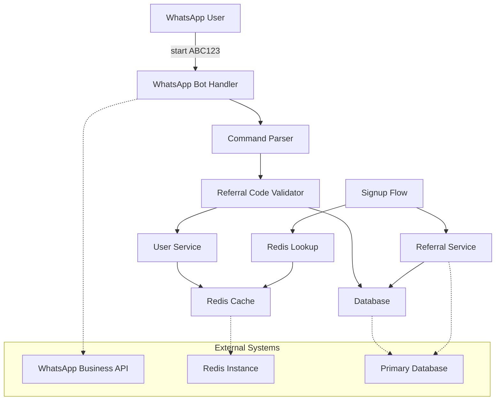

# Design Document: Referral Code Capture Flow

## Overview

This design document outlines the implementation of the referral code capture flow for the ChainPaye WhatsApp-based crypto payment application. The system enables new users to enter referral codes via a "start [referral_code]" command, validates and temporarily stores the codes in Redis, and integrates them into the signup process with personalized messaging.

The flow consists of three main phases:
1. **Code Capture**: User enters referral code via WhatsApp command
2. **Temporary Storage**: Code validation and Redis storage with TTL
3. **Signup Integration**: Code retrieval and relationship creation during signup

## Architecture

The referral code capture flow integrates with the existing WhatsApp bot infrastructure and extends the current referral system with temporary storage capabilities.

### System Components



### Data Flow

1. **Command Processing**: WhatsApp message → Command Parser → Validation
2. **Temporary Storage**: Validated code → Redis with phone number key → 24h TTL
3. **Personalized Response**: Referrer lookup → Name retrieval → Message formatting
4. **Signup Integration**: Phone number lookup → Redis retrieval → Form pre-population
5. **Relationship Creation**: Final validation → Database persistence → Redis cleanup

## Components and Interfaces

### Command Parser

Handles parsing of WhatsApp messages to extract referral codes from the "start" command.

```typescript
interface CommandParser {
  parseStartCommand(message: string): ParsedCommand | null;
  validateCommandFormat(command: string): boolean;
}

interface ParsedCommand {
  command: 'start';
  referralCode: string;
  phoneNumber: string;
}
```

### Referral Code Validator

Validates referral codes against the database and ensures business rules are enforced.

```typescript
interface ReferralCodeValidator {
  validateCode(code: string): Promise<ValidationResult>;
  getReferrerInfo(code: string): Promise<ReferrerInfo | null>;
}

interface ValidationResult {
  isValid: boolean;
  errorMessage?: string;
  referrerId?: string;
}

interface ReferrerInfo {
  id: string;
  name: string;
  referralCode: string;
}
```

### Redis Storage Service

Manages temporary storage of referral codes with automatic expiration.

```typescript
interface RedisStorageService {
  storeReferralCode(phoneNumber: string, referralCode: string): Promise<void>;
  retrieveReferralCode(phoneNumber: string): Promise<string | null>;
  removeReferralCode(phoneNumber: string): Promise<void>;
  setExpiration(key: string, ttlSeconds: number): Promise<void>;
}
```

### Signup Integration Service

Handles retrieval and integration of referral codes during the signup process.

```typescript
interface SignupIntegrationService {
  getStoredReferralCode(phoneNumber: string): Promise<string | null>;
  prePopulateReferralField(phoneNumber: string): Promise<SignupFormData>;
  processReferralOnSignup(userId: string, referralCode: string): Promise<void>;
}

interface SignupFormData {
  referralCode?: string;
  isPrePopulated: boolean;
}
```

## Data Models

### Redis Storage Schema

**Key Pattern**: `referral:temp:{phoneNumber}`
**Value**: Referral code string
**TTL**: 86400 seconds (24 hours)

```typescript
interface TempReferralStorage {
  key: string;        // "referral:temp:+1234567890"
  value: string;      // "ABC123"
  ttl: number;        // 86400 (seconds)
  createdAt: Date;
}
```

### Database Extensions

**Referral Relationships Table** (existing, no changes needed):
```sql
CREATE TABLE referral_relationships (
  id UUID PRIMARY KEY,
  referrer_id UUID NOT NULL,
  referred_user_id UUID NOT NULL,
  created_at TIMESTAMP NOT NULL,
  UNIQUE(referred_user_id)
);
```

**Users Table** (existing, referral_code field already present):
```sql
ALTER TABLE users ADD COLUMN referral_code VARCHAR(12) UNIQUE;
```

### Message Templates

```typescript
interface MessageTemplates {
  invitationMessage: (referrerName: string) => string;
  invalidCodeMessage: () => string;
  errorMessage: () => string;
  signupPrompt: () => string;
}
```

## Correctness Properties

*A property is a characteristic or behavior that should hold true across all valid executions of a system—essentially, a formal statement about what the system should do. Properties serve as the bridge between human-readable specifications and machine-verifiable correctness guarantees.*

Before defining the correctness properties, I need to analyze the acceptance criteria to determine which ones are testable as properties.

### Property 1: Referral Code Validation
*For any* referral code input, the validation function should correctly identify whether the code exists in the system and return appropriate validation results
**Validates: Requirements 2.1, 2.4**

### Property 2: Redis Storage with TTL
*For any* valid referral code and phone number combination, storing the code in Redis should use the phone number as the key and set a 24-hour expiration time
**Validates: Requirements 2.2, 10.1, 10.2**

### Property 3: Personalized Message Generation
*For any* valid referral code, the system should retrieve the correct referrer name and format the invitation message properly with that name
**Validates: Requirements 2.3**

### Property 4: Signup Code Lookup and Pre-population
*For any* phone number during signup, if a referral code exists in Redis for that number, the system should retrieve it and pre-populate the signup form
**Validates: Requirements 2.1.1, 2.1.2**

### Property 5: Signup Validation and Relationship Creation
*For any* referral code provided during signup completion, the system should validate the code again and create an immutable referral relationship if valid
**Validates: Requirements 2.1.4, 2.1.5**

### Property 6: Referral Relationship Immutability
*For any* user who already has a referral relationship, attempts to modify or create a new referral relationship should be rejected
**Validates: Requirements 2.1.6**

### Property 7: Self-Referral Prevention
*For any* user attempting to use their own referral code, the system should reject the self-referral attempt
**Validates: Requirements 2.1.7**

### Property 8: Expired Code Handling
*For any* Redis lookup of an expired or non-existent referral code, the system should handle the case gracefully without errors
**Validates: Requirements 10.3**

### Property 9: Redis Cleanup After Relationship Creation
*For any* successful referral relationship creation, the temporary referral code should be removed from Redis
**Validates: Requirements 10.4**

## Error Handling

### Command Parsing Errors
- **Invalid Command Format**: When users send malformed "start" commands, return clear usage instructions
- **Missing Referral Code**: When users send "start" without a code, prompt for the correct format
- **Special Characters**: Handle referral codes with special characters gracefully

### Validation Errors
- **Non-existent Codes**: Return user-friendly error messages for invalid referral codes
- **Self-Referral Attempts**: Provide specific error message explaining self-referral is not allowed
- **Already Referred Users**: Inform users they already have a referral relationship

### Redis Operation Errors
- **Connection Failures**: Implement fallback behavior when Redis is unavailable
- **Timeout Handling**: Set appropriate timeouts for Redis operations
- **Memory Limits**: Handle Redis memory pressure gracefully

### Database Operation Errors
- **Constraint Violations**: Handle unique constraint violations for referral relationships
- **Transaction Failures**: Implement proper rollback mechanisms
- **Connection Issues**: Retry logic for temporary database connectivity issues

## Testing Strategy

### Dual Testing Approach

The testing strategy employs both unit tests and property-based tests to ensure comprehensive coverage:

**Unit Tests** focus on:
- Specific command parsing examples ("start ABC123", "start", "invalid format")
- Edge cases like empty strings, special characters, and boundary conditions
- Integration points between WhatsApp bot, Redis, and database
- Error conditions and exception handling
- Specific message template formatting

**Property-Based Tests** focus on:
- Universal properties that hold for all inputs (as defined in Correctness Properties)
- Comprehensive input coverage through randomization
- Validation of business rules across all possible referral codes and phone numbers
- Redis storage and retrieval behavior across all valid inputs

### Property-Based Testing Configuration

- **Testing Library**: Use `fast-check` for TypeScript/JavaScript or `Hypothesis` for Python
- **Test Iterations**: Minimum 100 iterations per property test
- **Test Tagging**: Each property test must reference its design document property using the format:
  - **Feature: referral-system, Property 1: Referral Code Validation**
  - **Feature: referral-system, Property 2: Redis Storage with TTL**
  - etc.

### Test Data Generation

**For Property Tests**:
- Generate random valid referral codes (6-12 alphanumeric characters)
- Generate random invalid referral codes (various invalid formats)
- Generate random phone numbers in international format
- Generate random user IDs and referrer information

**For Unit Tests**:
- Predefined test cases for specific scenarios
- Boundary conditions (minimum/maximum code lengths)
- Special characters and encoding edge cases
- Network timeout and error simulation

### Integration Testing

- **WhatsApp Bot Integration**: Test complete flow from message receipt to response
- **Redis Integration**: Test storage, retrieval, and expiration behavior
- **Database Integration**: Test referral relationship creation and constraint enforcement
- **End-to-End Flow**: Test complete user journey from "start" command to signup completion

### Performance Testing

- **Redis Operation Latency**: Ensure operations complete within acceptable timeframes
- **Concurrent User Handling**: Test system behavior under multiple simultaneous referral code submissions
- **Memory Usage**: Monitor Redis memory consumption with TTL-based cleanup

This comprehensive testing approach ensures both correctness of individual components and proper integration across the entire referral code capture flow.