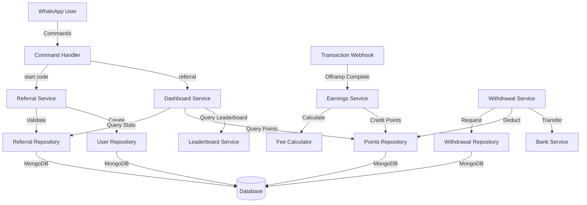

# Design Document: Referral System

## Overview

The referral system is a reward mechanism integrated into a WhatsApp-based crypto payment application. It enables users to earn points (equivalent to USD) by referring new users, with earnings calculated as 25% of transaction fees generated during the first 30 days after a referred user joins.

The system consists of several key components:
- Referral code generation and validation
- Referral relationship management
- Earnings calculation and point tracking
- Withdrawal request processing
- Dashboard and leaderboard display

## Architecture

### High-Level Architecture



### Component Interaction Flow

**Referral Code Generation Flow:**
1. User completes KYC
2. KYC webhook triggers referral code generation
3. Unique code is generated and stored in User document
4. User can now share their referral code

**Registration with Referral Flow:**
1. New user sends "start [referral_code]"
2. Command handler validates referral code exists
3. Referral relationship is created with timestamp
4. User registration continues normally

**Earnings Calculation Flow:**
1. Referred user completes offramp transaction
2. Transaction webhook triggers earnings calculation
3. System checks if referral relationship exists and is within 30 days
4. Fee is calculated (1.5% of transaction amount)
5. Referrer earnings calculated (25% of fee)
6. Points are credited to referrer's balance

**Withdrawal Flow:**
1. User requests withdrawal
2. System validates balance (≥$100) and frequency (once per week)
3. Withdrawal request created with "pending" status
4. After 24 hours, withdrawal is approved
5. Points deducted and bank transfer initiated

## Components and Interfaces

### 1. Referral Code Generator

**Responsibility:** Generate unique, shareable referral codes

**Interface:**
```typescript
interface ReferralCodeGenerator {
  generateCode(): Promise<string>;
  isCodeUnique(code: string): Promise<boolean>;
}
```

**Implementation Details:**
- Generate random alphanumeric strings (6-12 characters)
- Check uniqueness against existing codes in database
- Retry generation if collision occurs (unlikely but possible)
- Use cryptographically secure random generation

### 2. Referral Service

**Responsibility:** Manage referral relationships and validation

**Interface:**
```typescript
interface ReferralService {
  createReferralCode(userId: string): Promise<string>;
  validateReferralCode(code: string): Promise<boolean>;
  createReferralRelationship(referredUserId: string, referralCode: string): Promise<ReferralRelationship>;
  getReferralRelationship(userId: string): Promise<ReferralRelationship | null>;
  isWithinReferralPeriod(relationship: ReferralRelationship): boolean;
}

interface ReferralRelationship {
  referrerId: string;
  referredUserId: string;
  createdAt: Date;
  referralCode: string;
}
```

**Implementation Details:**
- Validate referral code exists before creating relationship
- Prevent self-referrals (referredUserId !== referrerId)
- Ensure referral relationship is immutable (one-time creation)
- Calculate 30-day period from createdAt timestamp

### 3. Earnings Service

**Responsibility:** Calculate and credit referral earnings

**Interface:**
```typescript
interface EarningsService {
  processTransactionEarnings(transaction: OfframpTransaction): Promise<void>;
  calculateFee(amount: number): number;
  calculateReferrerEarnings(fee: number): number;
}

interface OfframpTransaction {
  id: string;
  userId: string;
  amount: number;
  timestamp: Date;
}
```

**Implementation Details:**
- Fee calculation: `amount * 0.015` (1.5%)
- Referrer earnings: `fee * 0.25` (25%)
- Check referral relationship exists and is within 30 days
- Credit points atomically to prevent race conditions
- Log all earnings transactions for audit trail

### 4. Points Repository

**Responsibility:** Manage user point balances and transactions

**Interface:**
```typescript
interface PointsRepository {
  getBalance(userId: string): Promise<number>;
  getTotalEarned(userId: string): Promise<number>;
  creditPoints(userId: string, amount: number, transactionId: string): Promise<void>;
  debitPoints(userId: string, amount: number, withdrawalId: string): Promise<void>;
  getEarningsHistory(userId: string): Promise<EarningsRecord[]>;
}

interface EarningsRecord {
  userId: string;
  amount: number;
  transactionId: string;
  timestamp: Date;
  type: 'credit' | 'debit';
}
```

**Implementation Details:**
- Store current balance and total earned separately
- Use MongoDB transactions for atomic updates
- Maintain earnings history for transparency
- Prevent negative balances through validation

### 5. Withdrawal Service

**Responsibility:** Process withdrawal requests and bank transfers

**Interface:**
```typescript
interface WithdrawalService {
  requestWithdrawal(userId: string, amount: number): Promise<WithdrawalRequest>;
  canWithdraw(userId: string, amount: number): Promise<WithdrawalValidation>;
  approveWithdrawal(withdrawalId: string): Promise<void>;
  processWithdrawal(withdrawalId: string): Promise<void>;
}

interface WithdrawalRequest {
  id: string;
  userId: string;
  amount: number;
  status: 'pending' | 'approved' | 'completed' | 'failed';
  requestedAt: Date;
  approvedAt?: Date;
  completedAt?: Date;
}

interface WithdrawalValidation {
  canWithdraw: boolean;
  reason?: string;
}
```

**Implementation Details:**
- Validate minimum balance ($100)
- Check last withdrawal was at least 7 days ago
- Create withdrawal request with "pending" status
- Schedule approval after 24 hours
- Deduct points only after successful bank transfer
- Handle failure cases with appropriate rollback

### 6. Dashboard Service

**Responsibility:** Aggregate and display referral statistics

**Interface:**
```typescript
interface DashboardService {
  getDashboard(userId: string): Promise<ReferralDashboard>;
}

interface ReferralDashboard {
  referralCode: string;
  referralLink: string;
  totalReferred: number;
  currentBalance: number;
  totalEarned: number;
  totalVolume: number;
  totalFees: number;
  totalEarnings: number;
}
```

**Implementation Details:**
- Aggregate data from multiple collections
- Calculate total volume from referred users' transactions
- Calculate total fees from transaction history
- Cache dashboard data with short TTL for performance
- Format currency values appropriately

### 7. Leaderboard Service

**Responsibility:** Rank users by referral performance

**Interface:**
```typescript
interface LeaderboardService {
  getLeaderboard(limit: number): Promise<LeaderboardEntry[]>;
}

interface LeaderboardEntry {
  userId: string;
  username: string;
  totalEarned: number;
  totalReferred: number;
  rank: number;
}
```

**Implementation Details:**
- Sort by totalEarned in descending order
- Include totalReferred count for each entry
- Limit results to top N users (e.g., top 10 or 50)
- Cache leaderboard with longer TTL (e.g., 5 minutes)
- Update rankings periodically via background job

## Data Models

### User Model Extension

```typescript
interface User {
  id: string;
  phoneNumber: string;
  kycStatus: 'pending' | 'approved' | 'rejected';
  referralCode?: string;  // Added field
  referredBy?: string;    // Added field: referrer's userId
  referredAt?: Date;      // Added field: timestamp of referral
  // ... existing fields
}
```

### Referral Relationship Model

```typescript
interface ReferralRelationship {
  id: string;
  referrerId: string;
  referredUserId: string;
  referralCode: string;
  createdAt: Date;
  expiresAt: Date;  // createdAt + 30 days
}
```

**Indexes:**
- `referredUserId` (unique) - ensure one referral per user
- `referrerId` - query all referred users
- `referralCode` - validate codes quickly

### Points Balance Model

```typescript
interface PointsBalance {
  userId: string;
  currentBalance: number;
  totalEarned: number;
  lastUpdated: Date;
}
```

**Indexes:**
- `userId` (unique) - one balance per user
- `totalEarned` (descending) - leaderboard queries

### Earnings Transaction Model

```typescript
interface EarningsTransaction {
  id: string;
  userId: string;  // referrer who earned
  referredUserId: string;  // user who generated the transaction
  offrampTransactionId: string;
  amount: number;  // points earned
  feeAmount: number;  // original fee
  transactionAmount: number;  // original transaction amount
  timestamp: Date;
}
```

**Indexes:**
- `userId` - query user's earnings history
- `referredUserId` - track referred user's generated earnings
- `timestamp` - time-based queries

### Withdrawal Request Model

```typescript
interface WithdrawalRequest {
  id: string;
  userId: string;
  amount: number;
  status: 'pending' | 'approved' | 'completed' | 'failed';
  requestedAt: Date;
  approvedAt?: Date;
  completedAt?: Date;
  failureReason?: string;
  bankTransferId?: string;
}
```

**Indexes:**
- `userId` - query user's withdrawal history
- `status` - find pending withdrawals
- `requestedAt` - check withdrawal frequency


## Correctness Properties

A property is a characteristic or behavior that should hold true across all valid executions of a system—essentially, a formal statement about what the system should do. Properties serve as the bridge between human-readable specifications and machine-verifiable correctness guarantees.

### Property Reflection

After analyzing all acceptance criteria, I identified several redundancies:
- Requirements 8.3, 8.4, 8.5 duplicate 3.3, 3.4, 3.5 (referral period behavior)
- Requirements 9.1, 9.2 duplicate 2.1, 2.4 (validation and immutability)
- Requirement 6.8 duplicates 6.5 (total earnings display)
- Dashboard display properties (6.1-6.7) can be combined into comprehensive dashboard properties

The following properties eliminate these redundancies while maintaining complete coverage.

### Code Generation Properties

**Property 1: Referral code uniqueness**
*For any* set of users in the system, all referral codes must be unique with no duplicates.
**Validates: Requirements 1.2**

**Property 2: Referral code format compliance**
*For any* generated referral code, it must be alphanumeric and between 6-12 characters in length.
**Validates: Requirements 1.3**

**Property 3: Code generation persistence**
*For any* user who completes KYC, querying their user record immediately after code generation should return the generated referral code.
**Validates: Requirements 1.1, 1.4**

### Referral Relationship Properties

**Property 4: Valid code acceptance**
*For any* valid referral code provided during registration, the system should create a referral relationship linking the referred user to the referrer.
**Validates: Requirements 2.1, 2.2**

**Property 5: Invalid code rejection**
*For any* non-existent referral code provided during registration, the system should reject it and return an error message.
**Validates: Requirements 2.3**

**Property 6: Referral relationship immutability**
*For any* user with an existing referral relationship, any attempt to modify or create a new referral relationship should be rejected.
**Validates: Requirements 2.4, 9.2**

**Property 7: Self-referral prevention**
*For any* user attempting to use their own referral code, the system should reject the self-referral.
**Validates: Requirements 2.5**

**Property 8: Relationship timestamp persistence**
*For any* created referral relationship, the createdAt timestamp should be stored and retrievable.
**Validates: Requirements 8.1**

### Earnings Calculation Properties

**Property 9: Fee calculation accuracy**
*For any* offramp transaction amount, the calculated fee should equal exactly 1.5% of that amount.
**Validates: Requirements 3.1**

**Property 10: Referrer earnings calculation accuracy**
*For any* transaction fee, the referrer earnings should equal exactly 25% of that fee.
**Validates: Requirements 3.2**

**Property 11: Earnings within referral period**
*For any* offramp transaction by a referred user where the elapsed time since referral is ≤ 30 days, the referrer's point balance should increase by the calculated earnings amount.
**Validates: Requirements 3.3, 8.3**

**Property 12: No earnings after referral period**
*For any* offramp transaction by a referred user where the elapsed time since referral exceeds 30 days, the referrer's point balance should remain unchanged.
**Validates: Requirements 3.4, 8.4**

**Property 13: Relationship persistence beyond earning period**
*For any* referral relationship, it should remain queryable and intact regardless of how much time has elapsed since creation.
**Validates: Requirements 3.5, 8.5**

**Property 14: Decimal precision in calculations**
*For any* earnings calculation involving non-integer amounts, the result should maintain at least 2 decimal places of precision.
**Validates: Requirements 9.3**

### Point Balance Properties

**Property 15: Balance increase on earnings**
*For any* referral earnings event, the referrer's current balance should increase by exactly the earnings amount.
**Validates: Requirements 4.2**

**Property 16: Balance decrease on withdrawal**
*For any* completed withdrawal, the user's current balance should decrease by exactly the withdrawal amount.
**Validates: Requirements 4.3**

**Property 17: Total earned invariant**
*For any* user at any point in time, their total earned points should be greater than or equal to their current balance.
**Validates: Requirements 4.4**

**Property 18: Non-negative balance invariant**
*For any* sequence of earnings and withdrawal operations, a user's point balance should never become negative.
**Validates: Requirements 4.5**

### Withdrawal Validation Properties

**Property 19: Minimum withdrawal validation**
*For any* withdrawal request where the user's balance is less than $100, the request should be rejected with an appropriate error message.
**Validates: Requirements 5.1, 5.6**

**Property 20: Withdrawal frequency validation**
*For any* user who has made a withdrawal request in the past 7 days, a new withdrawal request should be rejected with an appropriate error message.
**Validates: Requirements 5.2, 5.6**

**Property 21: Pending withdrawal creation**
*For any* valid withdrawal request, a withdrawal record with status "pending" should be created immediately.
**Validates: Requirements 5.3**

**Property 22: Withdrawal approval balance deduction**
*For any* withdrawal that transitions from "pending" to "approved" to "completed", the user's balance should decrease by the withdrawal amount exactly once.
**Validates: Requirements 5.5**

### Dashboard Properties

**Property 23: Dashboard completeness**
*For any* user requesting their dashboard, the response should include all required fields: referralCode, referralLink, totalReferred, currentBalance, totalEarned, totalVolume, totalFees, and totalEarnings.
**Validates: Requirements 6.1, 6.2, 6.3, 6.4, 6.5, 6.6, 6.7, 6.8**

**Property 24: Referral count accuracy**
*For any* user, the totalReferred count in their dashboard should equal the number of users who have a referral relationship with them as the referrer.
**Validates: Requirements 6.3**

**Property 25: Volume aggregation accuracy**
*For any* user, the totalVolume in their dashboard should equal the sum of all offramp transaction amounts from users they referred.
**Validates: Requirements 6.6**

**Property 26: Fee aggregation accuracy**
*For any* user, the totalFees in their dashboard should equal the sum of all fees (1.5% of transaction amounts) from users they referred.
**Validates: Requirements 6.7**

### Leaderboard Properties

**Property 27: Leaderboard sorting correctness**
*For any* leaderboard with N entries, each entry at position i should have totalEarned ≥ totalEarned of entry at position i+1 (descending order).
**Validates: Requirements 7.1**

**Property 28: Leaderboard entry completeness**
*For any* entry in the leaderboard, it should include userId, totalEarned, and totalReferred fields.
**Validates: Requirements 7.2, 7.3**

### Audit Trail Properties

**Property 29: Earnings transaction audit trail**
*For any* referral earnings event, a complete earnings transaction record should be persisted with userId, amount, timestamp, and offrampTransactionId.
**Validates: Requirements 9.4**

**Property 30: Withdrawal request audit trail**
*For any* withdrawal request, a complete withdrawal record should be persisted with userId, amount, status, and requestedAt timestamp.
**Validates: Requirements 9.5**

## Error Handling

### Validation Errors

**Invalid Referral Code:**
- Error: "Invalid referral code. Please check and try again."
- HTTP Status: 400 Bad Request
- Occurs when: User provides non-existent referral code

**Self-Referral Attempt:**
- Error: "You cannot use your own referral code."
- HTTP Status: 400 Bad Request
- Occurs when: User attempts to refer themselves

**Duplicate Referral:**
- Error: "You have already been referred by another user."
- HTTP Status: 409 Conflict
- Occurs when: User with existing referral tries to add another

**Insufficient Balance:**
- Error: "Minimum withdrawal amount is $100. Your current balance is $X."
- HTTP Status: 400 Bad Request
- Occurs when: User requests withdrawal with balance < $100

**Withdrawal Frequency Exceeded:**
- Error: "You can only withdraw once per week. Your last withdrawal was on [date]."
- HTTP Status: 429 Too Many Requests
- Occurs when: User requests withdrawal within 7 days of previous request

### System Errors

**Code Generation Failure:**
- Error: "Unable to generate referral code. Please try again."
- HTTP Status: 500 Internal Server Error
- Occurs when: Code generation fails after multiple retries
- Recovery: Retry with exponential backoff

**Database Transaction Failure:**
- Error: "Transaction failed. Please try again."
- HTTP Status: 500 Internal Server Error
- Occurs when: MongoDB transaction fails
- Recovery: Rollback and retry with idempotency key

**Bank Transfer Failure:**
- Error: "Withdrawal processing failed. Your balance has been restored."
- HTTP Status: 500 Internal Server Error
- Occurs when: Bank transfer API fails
- Recovery: Rollback point deduction, mark withdrawal as "failed"

### Error Handling Strategy

1. **Validation errors**: Return immediately with descriptive message
2. **Transient errors**: Retry with exponential backoff (max 3 attempts)
3. **Critical errors**: Log to monitoring system, alert on-call engineer
4. **Financial errors**: Always rollback on failure, maintain audit trail
5. **User-facing errors**: Provide clear, actionable error messages

## Testing Strategy

### Dual Testing Approach

The referral system requires both unit tests and property-based tests for comprehensive coverage:

**Unit Tests** focus on:
- Specific examples of calculations (e.g., $1000 transaction → $15 fee → $3.75 earnings)
- Edge cases (e.g., exactly 30 days elapsed, exactly $100 balance)
- Error conditions (e.g., invalid codes, insufficient balance)
- Integration points (e.g., webhook handlers, command handlers)

**Property-Based Tests** focus on:
- Universal properties that hold for all inputs
- Comprehensive input coverage through randomization
- Invariants that must always be maintained
- Mathematical properties (calculations, aggregations)

### Property-Based Testing Configuration

**Library Selection:**
- TypeScript/JavaScript: Use `fast-check` library
- Minimum 100 iterations per property test
- Each test must reference its design document property

**Test Tagging Format:**
```typescript
// Feature: referral-system, Property 9: Fee calculation accuracy
test('fee calculation should be exactly 1.5% of transaction amount', () => {
  fc.assert(
    fc.property(fc.float({ min: 0.01, max: 1000000 }), (amount) => {
      const fee = calculateFee(amount);
      expect(fee).toBeCloseTo(amount * 0.015, 2);
    }),
    { numRuns: 100 }
  );
});
```

### Test Coverage Requirements

**Code Generation (Properties 1-3):**
- Unit: Test specific code formats, collision handling
- Property: Test uniqueness across large sets, format compliance for all generated codes

**Referral Relationships (Properties 4-8):**
- Unit: Test specific validation scenarios, error messages
- Property: Test immutability, validation for all possible inputs

**Earnings Calculation (Properties 9-14):**
- Unit: Test specific transaction amounts, boundary cases (exactly 30 days)
- Property: Test calculation accuracy for all amounts, period validation for all timestamps

**Point Balance (Properties 15-18):**
- Unit: Test specific balance operations, edge cases
- Property: Test invariants hold across all operation sequences

**Withdrawals (Properties 19-22):**
- Unit: Test specific validation scenarios, approval flow
- Property: Test validation rules for all inputs, balance consistency

**Dashboard & Leaderboard (Properties 23-28):**
- Unit: Test specific aggregation scenarios, formatting
- Property: Test aggregation accuracy for all data sets, sorting correctness

**Audit Trail (Properties 29-30):**
- Unit: Test specific record creation scenarios
- Property: Test completeness for all events

### Integration Testing

**End-to-End Flows:**
1. Complete referral flow: KYC → code generation → new user registration → transaction → earnings
2. Withdrawal flow: Accumulate points → request withdrawal → approval → bank transfer
3. Dashboard flow: Multiple referrals → transactions → dashboard display

**External Dependencies:**
- Mock WhatsApp webhook for command testing
- Mock bank transfer API for withdrawal testing
- Use in-memory MongoDB for faster test execution

### Performance Testing

**Load Testing Scenarios:**
- 1000 concurrent referral code generations
- 10,000 concurrent earnings calculations
- Dashboard queries with 1M+ users
- Leaderboard queries with 100K+ active referrers

**Performance Targets:**
- Code generation: < 100ms p95
- Earnings calculation: < 50ms p95
- Dashboard query: < 200ms p95
- Leaderboard query: < 300ms p95

### Monitoring and Observability

**Key Metrics:**
- Referral code generation rate and failures
- Earnings calculation latency and errors
- Withdrawal request volume and approval rate
- Dashboard query latency
- Point balance consistency checks

**Alerts:**
- Code generation failure rate > 1%
- Earnings calculation errors > 0.1%
- Withdrawal processing failures > 0.5%
- Negative balance detected (critical)
- Balance inconsistency detected (critical)
